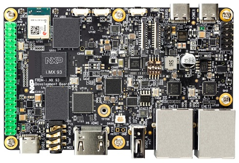
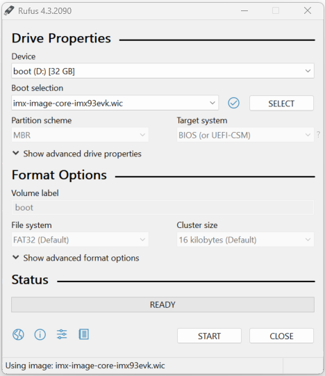

# VEE Port for NXP i.MX93

This project is used to build a VEE Port for the i.MX 93 Evaluation Kit and FRDM i.MX 93 Development Board.

It relies on the generic Abstraction Layer for Linux available [here](https://github.com/MicroEJ/AbstractionLayer-Linux/blob/master/README.md)

<p float="left">
  
   
</p>

Ensure you have cloned the repository and all its submodules.

To update git submodules, run the following command ``git submodule update --init --recursive`` at the root of this project.

## Related Files

This directory also contains:

* [CHANGELOG](./CHANGELOG.md) to track the changes in the VEE Port 
* [RELEASE NOTES](./RELEASE_NOTES.md) to list:

  - the supported hardware,
  - the known issues and the limitations,
  - the development environment,
  - the list of the dependencies and their versions.

* [README Abstraction Layer Linux](https://github.com/MicroEJ/AbstractionLayer-Linux/blob/master/README.md) recommended for users familiar with the BSP
  and advanced usage on how to customize the build process.

## Board Technical Specifications

|                         | i.MX93 EVK            | FRDM i.MX93           |
|-------------------------|-----------------------|-----------------------|
| Revision                | A                     | A                     |
| MPU part number         | i.MX93                | i.MX93                |
| MPU architecture        | Dual Cortex-A55       | Dual Cortex-A55       |
| MPU max clock frequency | 1.7GHz                | 1.7GHz                |
| Flash (or SDcard slot)  | 16 GB eMMC5.1         | 32 GB eMMC5.1         |
| RAM size                | 2 GB LPDDR4X / LPDDR4 | 2 GB LPDDR4X / LPDDR4 |

Here is a list of i.MX93 EVK useful documentation links:

- Board documentation available [here](https://www.nxp.com/design/design-center/development-boards-and-designs/i.MX93EVK)
- Getting Started available [here](https://www.nxp.com/document/guide/getting-started-with-the-i-mx93-evk:GS-IMX93EVK)
- Board User Manual available [here](https://www.nxp.com/webapp/Download?colCode=MCIMX93EVKUM)

Here is a list of FRDM i.MX93 useful documentation links:

- Board documentation available [here](https://www.nxp.com/design/design-center/development-boards-and-designs/frdm-i-mx-93-development-board:FRDM-IMX93)
- Getting Started available [here](https://www.nxp.com/document/guide/getting-started-with-frdm-imx93:GS-FRDM-IMX93)
- Board User Manual available [here](https://www.nxp.com/webapp/Download?colCode=UM12181)

Common Documentation:

- MPU Technical Reference Manual available [here](https://www.nxp.com/webapp/Download?colCode=IMX93RM)
- MPU Errata available [here](https://www.nxp.com/docs/en/errata/i.MX93_1P87f.pdf)
- i.MX Linux Yocto Project available [here](https://github.com/nxp-imx/meta-imx)

## VEE Port Specifications

The Architecture version is `8.4.0`.

This VEE Port provides the following Foundation Libraries:

| Foundation Library | Version |
|--------------------|---------|
| BON                | 1.4     |
| DEVICE             | 1.2     |
| DRAWING            | 1.0     |
| ECOM-NETWORK       | 2.1     |
| EVENT              | 2.1     |
| FS                 | 2.1     |
| KF                 | 1.7     |
| MICROUI            | 3.5     |
| NET                | 1.1     |
| RESOURCEMANAGER    | 1.0     |
| SECURITY           | 1.7     |
| SNI                | 1.4     |
| SSL                | 2.2     |
| TRACE              | 1.1     |
| WATCHDOG           | 1.0     |

The VEE Port is derived into:

- a Mono-Sandbox VEE Port (default)
- a Multi-Sandbox VEE Port

## Requirements

- OS
  - Windows 10 and WSL2 (tested with Ubuntu 22.04)
  - Linux (tested with Ubuntu 22.04)
- Internet connection to [MicroEJ Central Repository](https://developer.microej.com/central-repository/)
- i.MX93 board (EVK or FRDM board)

## VEE Port i.MX93 Setup

[Open the VEE Port project in your favorite IDE](https://docs.microej.com/en/latest/SDK6UserGuide/importProject.html)
by selecting the root folder of the cloned repository.

The project contains the following subprojects:

- `vee-port`: Contains the VEE Port i.MX93 configuration description.
  Some modules are described in a specific sub-folder / with some optional configuration files
  (`.properties` and / or `.xml`).

- `linux-abstraction-layer`: Contains a ready-to-use Abstraction Layer project, including a CMake project and
  an implementation of MicroEJ Core Engine (and extensions) port on Linux.

- `vee-port/extensions/front-panel`: Contains the board description and images for the Simulator.
  This project is updated once the VEE Port i.MX93 is built.

- `app`: Contains a sample application which uses the VEE Port i.MX93.

By default, the VEE Port i.MX93 is configured as a Mono-Sandbox Evaluation VEE Port.
Refer to the [RELEASE NOTES](./RELEASE_NOTES.md) limitations section for more details.

## Run an Application on the Simulator

To run an Application on the Simulator, the BSP or C/C++ Toolchain are not required.

- Run the `app` sample Application [on the Simulator](https://docs.microej.com/en/latest/SDK6UserGuide/runOnSimulator.html).
  This automatically builds the VEE Port i.MX93 and uses it.

The build may take several minutes.
The first time, the VEE Port i.MX93 build requires to download modules that are available on the MicroEJ Central Repository.

Wait for the Application to start. It is a simple Hello World drawn on the screen.

An evaluation license is needed for building an Application. Refer to
https://docs.microej.com/en/latest/SDK6UserGuide/licenses.html#evaluation-licenses
for information on how to acquire and activate a license.

## Board Setup

Please refer to NXP documentation for [iMX93 EVK](https://www.nxp.com/webapp/Download?colCode=MCIMX93EVKUM) or [FRDM i.MX93](https://www.nxp.com/webapp/Download?colCode=UM12181) for more details.

### Power Supply

The board is powered via a USB-C connector.

### Logs Output

A serial port is available (DBG or DEBUG USB port), it provides access to the shell.

To connect to this port use the following settings:

|              |          |
|--------------|----------|
| Baudrate     | 115200   |
| Data bits    | 8        |
| Parity bits  | None     |
| Stop bits    | 1        |
| Flow control | XON/XOFF |

## Run an Application on the Device

To build and run the Application on the Device, the Yocto Image and SDK are required.

Note: if you wish to build your own Image and SDK, see [Advanced Tips](#advanced-tips)

### Host Configuration

The compilation requires Linux, or WSL for Windows.

MicroEJ applications are deployed on the target via SSH.

To setup WSL, and the SSH connection, follow the [Host Configuration README](https://github.com/MicroEJ/AbstractionLayer-Linux/blob/master/README.md#host-configuration).

### Toolchain Setup

We provide precompiled Yocto SDKs for i.MX93 EVK and FRDM-iMX93.
- [i.MX 93 EVK Yocto SDK installer](https://repository.microej.com/packages/yocto/i.MX93EVK/2024-04-30-IMX93-oecore-x86_64-armv7at2hf-neon-vfpv4-toolchain-nodistro-1.0.0.sh)
- [FRDM i.MX 93 Yocto SDK installer](https://repository.microej.com/packages/yocto/i.MX93FRDM/20250731_1.0.0_fsl-imx-xwayland-glibc-x86_64-core-image-microej-armv8a-imx93frdm-toolchain-6.6-scarthgap.sh)

Here is the procedure for i.MX93 EVK, using WSL or Linux:

```
$ curl -O https://repository.microej.com/packages/yocto/i.MX93EVK/2024-04-30-IMX93-oecore-x86_64-armv7at2hf-neon-vfpv4-toolchain-nodistro-1.0.0.sh
$ chmod +x 2024-04-30-IMX93-oecore-x86_64-armv7at2hf-neon-vfpv4-toolchain-nodistro-1.0.0.sh
$ ./2024-04-30-IMX93-oecore-x86_64-armv7at2hf-neon-vfpv4-toolchain-nodistro-1.0.0.sh
MicroEJ: 32-bit userspace + 64-bit kernel SDK installer version nodistro.0
==========================================================================
Enter target directory for SDK (default: /usr/local/oecore-x86_64):
You are about to install the SDK to "/usr/local/oecore-x86_64". Proceed [Y/n]? y
Extracting SDK......................................................................done
Setting it up...done
SDK has been successfully set up and is ready to be used.
Each time you wish to use the SDK in a new shell session, you need to source the environment setup script e.g.
 $ . /usr/local/oecore-x86_64/environment-setup-armv7at2hf-neon-vfpv4-oemllib32-linux-gnueabi
 $ . /usr/local/oecore-x86_64/environment-setup-cortexa55-oe-linux
```

The default toolchain installation path is preconfigured in [set_project_env.sh](vee-port/bsp/set_project_env.sh):

```
YOCTO_SDK_INSTALL=/usr/local/oecore-x86_64
YOCTO_SDK_ENV_SCRIPT=environment-setup-armv7at2hf-neon-vfpv4-oemllib32-linux-gnueabi
```
For i.MX93 FRDM, if you may have to update the configuration with:
```
YOCTO_SDK_INSTALL=/opt/fsl-imx-fb/6.1-mickledore
YOCTO_SDK_ENV_SCRIPT=environment-setup-armv7at2hf-neon-pokymllib32-linux-gnueabi
```

### Flash Yocto image on the SD Card

We provide precompiled Yocto Images for i.MX93 EVK and FRDM-iMX93. Click on the links below to download the images.
- [i.MX 93 EVK Yocto Image](https://repository.microej.com/packages/yocto/i.MX93EVK/2024-05-24-IMX93-lib32-core-image-microej-microej-imx93-1.0.2.wic.gz)
- [FRDM i.MX 93 Yocto Image](https://repository.microej.com/packages/yocto/i.MX93FRDM/20250731_1.0.0_core-image-microej-imx93frdm.rootfs.wic.zst)

The Linux image is flashed on an SD card.

To flash the image follow the steps corresponding to your OS:

#### Linux

To flash the image on Linux, please refer to the [i.MX Linux User Guide](https://www.nxp.com/docs/en/user-guide/IMX_LINUX_USERS_GUIDE.pdf)

First you must unzip the file with `gzip` or `ztd` depending on the extension, then flash the whole SD card with it.

As an example, if you are flashing the FRDM image on the SD card:

```
zstd -dfk /mnt/c/tmp/imx-image-core-imx93evk.wic.zst
dd if=imx-image-core-imx93evk.wic of=<insert SDcard device here>
```

#### Windows

To flash the image on Windows, do the following:

* Install Rufus: https://rufus.ie/en/.
* Select your SD card device in the list at the top (see example of configuration below).
* Select your `.wic.zst` or `.wic.gz` file by clicking on `SELECT`
* Finally click on `START` at the bottom and wait for the process to finish.



### Build and Run the Application

- Run the `app` sample Application [on Device](https://docs.microej.com/en/latest/SDK6UserGuide/runOnDevice.html).
  This automatically builds the VEE Port i.MX93 and uses it.

The build may take several minutes.  
The first time, the VEE Port i.MX93 build requires to download modules that are available on the MicroEJ Central Repository.  
The VEE Port i.MX93 will also build the `linux-abstraction-layer` project and link it with MicroEJ VEE and the Application to produce an executable.

Wait for the Application start, or for the final message:

```sh
BUILD SUCCESSFUL
```

## Test Suite Configuration

Test suites configuration projects are located here: `vee-port/validation`.

To run the test suites please refer to
https://docs.microej.com/en/latest/Tutorials/tutorialRunATestSuiteOnDevice.html

## Advanced Tips

### Build your own Yocto Image and SDK

#### i.MX Yocto Setup

Please refer to the [i.MX Yocto Project User's Guide](https://www.nxp.com/doc/IMX_YOCTO_PROJECT_USERS_GUIDE)
for instructions on how to build a Yocto image for i.MX targets.

The following is a simplified procedure to build a firmware and a Yocto SDK for i.MX93EVK board.

#### Build Yocto Image and SDK

This VEE Port has been tested with the following release of i.MX Yocto.

First, fetch the source code:

```
repo init -u https://github.com/nxp-imx/imx-manifest -b imx-linux-mickledore -m imx-6.1.55-2.2.0.xml
repo sync
```

Then, setup the build for i.MX93EVK:

```
MACHINE=imx93evk DISTRO=fsl-imx-fb source imx-setup-release.sh -b build
```

Then, add the necessary 32bit librairies:

```
echo -e "\n#Enable multilib support"                                           >> ./conf/local.conf
echo -e "require conf/multilib.conf"                                           >> ./conf/local.conf
echo -e "MULTILIBS = \"multilib:lib32\""                                       >> ./conf/local.conf
echo -e "DEFAULTTUNE:virtclass-multilib-lib32 = \"armv7athf-neon\""            >> ./conf/local.conf
echo -e "IMAGE_INSTALL:append = \" lib32-glibc lib32-libgcc lib32-libstdc++\"" >> ./conf/local.conf

echo -e "#Multilib does not support debian packaging"                          >> ./conf/local.conf
sed 's/PACKAGE_CLASSES/#PACKAGE_CLASSES/g' -i ./conf/local.conf
sed 's/EXTRA_IMAGE_FEATURES/#EXTRA_IMAGE_FEATURES/g' -i ./conf/local.conf

echo -e "# Librairies dependencies"                                            >> ./conf/local.conf
echo -e "IMAGE_INSTALL:append = \" lib32-libssl lib32-libdrm lib32-tslib\""    >> ./conf/local.conf 

echo -e "# Tools"                                                              >> ./conf/local.conf
echo -e "IMAGE_INSTALL:append = \" tslib-calibrate\""                          >> ./conf/local.conf 
```

Then build the target `imx-image-core`:

```
bitbake imx-image-core
```

The resulting image is `build/tmp/deploy/images/imx93evk/imx-image-core-imx93evk.wic.zst`


#### Build and Install Yocto SDK

In the same workspace, generate the Yocto SDK, which will be used by MicroEJ SDK to build and link the application.

```
bitbake imx-image-core -c populate_sdk
```

The resulting SDK is `build/tmp/deploy/sdk/fsl-imx-fb-glibc-x86_64-imx-image-core-armv8a-imx93evk-toolchain-6.1-mickledore.sh`

Once the SDK is extracted, you need to update its installation path in MicroEJ Abstraction layer.

In our case, we must edit [set_project_env.sh](vee-port/bsp/set_project_env.sh) with the 32bit toolchain:

```
YOCTO_SDK_INSTALL=/opt/fsl-imx-fb/6.1-mickledore
YOCTO_SDK_ENV_SCRIPT=environment-setup-armv7at2hf-neon-pokymllib32-linux-gnueabi
```

### Build the Abstraction Layer Manually

This section shows how to build the `linux-abstraction-layer` project manually without having to rebuild the application.

Note: this can only be done if `buildExecutable` or `runOnDevice` have been called at least once, see [Run on Device](https://docs.microej.com/en/latest/SDK6UserGuide/runOnDevice.html)

To build the `linux-abstraction-layer` project, open a
terminal and enter the following command lines:

**On Windows:**

```sh
$ cd "linux-abstraction-layer/vee/scripts"
$ build.bat
```

**On Linux / macOS:**

```sh
$ cd "linux-abstraction-layer/vee/scripts"
$ build.sh
```

You can now run your program:

**On Windows:**
```sh
$ cd "linux-abstraction-layer/vee/scripts"
$ run.bat
```

**On Linux / macOS:**

```sh
$ cd "linux-abstraction-layer/vee/scripts"
$ run.sh
```

## Troubleshooting

### Restart the Application Manually

When we are running the application in Embedded mode, everything is done by a script called `run.sh`.
See [README Abstraction Layer Linux](https://github.com/MicroEJ/AbstractionLayer-Linux/blob/master/README.md) for more details.

Basically this script will scp the executable onto the target and run it with some environment variables.

For debugging purposes, you can restart the application manually:

```
root@imx93evk:~# killall application.out
root@imx93evk:~# LLDISPLAY_USE_VSYNC=1 /bin/application.out
```
Other variables are useful for debugging purposes (see section about the touchscreen below).

### Display not Detected

If the application prints this log, it means that the application has not been able to detect the display:
```
[LLDISPLAY][WARNING] Frame buffer not available, skipping display setup
```
You can confirm if the DRM display driver has detected the display with this command:
```
root@microej-imx93:~# modetest
...
trying to open device 'imx-drm'...failed
...
```
If it prints `'imx-drm'...failed` then you may have to check your connectors or reboot the board.

If it prints `'imx-drm' ...done` and then list of connectors, resolution and EDID, then the display has been detected.

Remarks:
- The MicroEJ application will select the first connected display device, and its first available resolution.
- This release has been tested with MageDok [T080A portable HDMI touchscreen display](https://store.magedok.com/products/8-inch-1280-720-resolution-touch-monitor-t080a).

### USB HID Touch Screen is not Detected

Our VEE port UI abstraction layer relies on [tslib](https://github.com/libts/tslib) to receive inputs from the touchscreen.
The prerequisite is to have a USB HID event device mounted to `/dev/input/touchscreen0` which supports ABS event types.

If you cannot see such device here are some tips:

- unplug/plug the USB port connected to your HID device and look for logs in dmesg, you should see a HID device detected

- be sure to use a USB host cable to connect to your screen (i.e USB host on the board side, USB client on the screen side)

- If you see these logs: `tslib: Selected device is not a touchscreen (must support ABS event type)`, you can use `evtest` to see which devices are connected and if they support ABS event types:

```
root@imx93evk:~# evtest
No device specified, trying to scan all of /dev/input/event*
Available devices:
/dev/input/event0:      44440000.bbnsm:pwrkey
/dev/input/event1:      WM8962 Beep Generator
/dev/input/event2:      wch.cn USB2IIC_CTP_CONTROL
Select the device event number [0-2]: 2
Input driver version is 1.0.1
Input device ID: bus 0x3 vendor 0x222a product 0x1 version 0x100
Input device name: "wch.cn USB2IIC_CTP_CONTROL"
Supported events:
 Event type 0 (EV_SYN)
 Event type 1 (EV_KEY)
   Event code 330 (BTN_TOUCH)
 Event type 3 (EV_ABS)
   Event code 0 (ABS_X)
     Value   2787
     Min        0
     Max     4096
     Resolution      19
   Event code 1 (ABS_Y)
     Value   1541
     Min        0
     Max     4096
     Resolution      30
```

in this case the device `/dev/input/event2` supports abs event types

- finally, check which input device is linked to `/dev/input/touchscreen0`, as this is the default device used by our application.

Note: you can change the input device by setting a global variable before running the app, ex: 

```
root@imx93evk:~# TSLIB_TSDEVICE=/dev/input/event0 /tmp/application.out
```

### Touchscreen is not Responding on the Whole Screen

This may be caused by a missing or outdated calibration.
In the Yocto image, we have added the `ts_calibrate` utility from [tslib](https://github.com/libts/tslib)
which will save the calibration data to `/etc/pointercal`.

Try to run the calibration again, and restart the application.

```
root@imx93evk:~# ts_calibrate
xres = 1280, yres = 720
Took 3 samples...
Top left : X =  147 Y =  199
Took 5 samples...
Top right : X = 3933 Y =  135
Took 5 samples...
Bot right : X = 3953 Y = 3783
Took 4 samples...
Bot left : X =  139 Y = 3770
Took 5 samples...
Center : X = 2037 Y = 2034
7.019714 0.310518 -0.000522
16.952881 0.001149 0.171707
Calibration constants: 460044 20350 -34 1111024 75 11252 65536
```

---
_Markdown_  
_Copyright 2024-2025 MicroEJ Corp. All rights reserved._  
_Use of this source code is governed by a BSD-style license that can be found with this software._  
