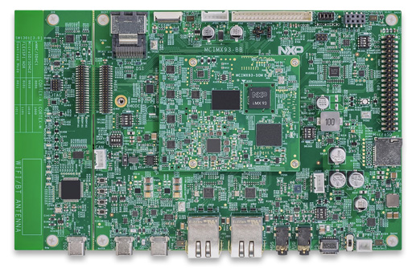
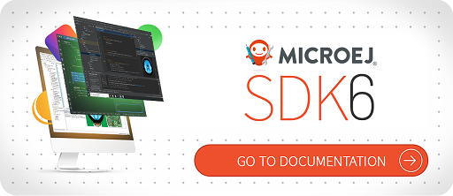

.. image:: https://shields.microej.com/endpoint?url=https://repository.microej.com/packages/badges/sdk_5.x.json
   :alt: sdk_5.x badge
   :align: left

.. image:: https://shields.microej.com/endpoint?url=https://repository.microej.com/packages/badges/arch_8.1.json
   :alt: arch_8.1 badge
   :align: left

.. image:: https://shields.microej.com/endpoint?url=https://repository.microej.com/packages/badges/gui_3.json
   :alt: gui_3 badge
   :align: left

..
    Copyright 2024 MicroEJ Corp. All rights reserved.
    Use of this source code is governed by a BSD-style license that can be found with this software.

.. |BOARD_NAME| replace:: i.MX93EVK
.. |BOARD_REVISION| replace:: A
.. |RCP| replace:: MICROEJ SDK
.. |VEEPORT| replace:: VEE Port
.. |SIM| replace:: Simulator
.. |CIDE| replace:: GCC ARM
.. |RTOS| replace:: Linux
.. |MANUFACTURER| replace:: NXP
.. |MICROEJ_ARCHITECTURE_VERSION| replace:: 8.1.1

.. _README LINUX: https://github.com/MicroEJ/AbstractionLayer-Linux/blob/master/README.md
.. _RELEASE NOTES: ./RELEASE_NOTES.rst
.. _CHANGELOG: ./CHANGELOG.rst

=========================================
|VEEPORT| for |MANUFACTURER| |BOARD_NAME|
=========================================

This project is used to build a |VEEPORT| for the |BOARD_NAME| development board.

It relies on the generic Abstraction Layer for Linux available here `README LINUX`_

Ensure you have cloned the repository and all its submodules. To update git submodules, run the following command ``git submodule update --init --recursive`` at the root of this project.

Related Files
=============

This directory also contains:

* `CHANGELOG`_ to track the changes in the |VEEPORT| for |BOARD_NAME| 
* `RELEASE NOTES`_ to list:

  - the supported hardware,
  - the known issues and the limitations,
  - the development environment,
  - the list of the dependencies and their versions.

* `README LINUX`_ recommended for users familiar with the |MANUFACTURER| SDK/BSP
  and advanced usage on how to customize the build process.

Board Technical Specifications
==============================

.. list-table::

   * - Name
     - |BOARD_NAME|
   * - Revision
     - |BOARD_REVISION|
   * - MPU part number
     - i.MX93
   * - MPU architecture
     - Dual Cortex-A55
   * - MPU max clock frequency
     - 1.7GHz
   * - Flash size
     - 16 GB eMMC5.1
   * - RAM size
     - 2 GB LPDDR4X / LPDDR4

Here is a list of |BOARD_NAME| useful documentation links:

- Board documentation available `here <https://www.nxp.com/webapp/Download?colCode=MCIMX93EVKUM>`__
- |MANUFACTURER| board Getting Started available `here <https://www.nxp.com/document/guide/getting-started-with-the-i-mx93-evk:GS-IMX93EVK>`__
- MPU Technical Reference Manual available `here <https://www.nxp.com/webapp/Download?colCode=IMX93RM>`__
- MPU Errata available `here <https://www.nxp.com/docs/en/errata/i.MX93_1P87f.pdf>`__
- i.MX Linux Yocto Project available `here <https://github.com/nxp-imx/meta-imx>`__

|VEEPORT| Specifications
========================

The Architecture version is |MICROEJ_ARCHITECTURE_VERSION|.

This |VEEPORT| provides the following Foundation Libraries:

.. list-table::
   :header-rows: 1

   * - Foundation Library
     - Version
   * - BON
     - 1.4
   * - DEVICE
     - 1.2
   * - DRAWING
     - 1.0
   * - ECOM-NETWORK
     - 2.1
   * - FS
     - 2.1
   * - KF
     - 1.7
   * - MICROUI
     - 3.5
   * - NET
     - 1.1
   * - RESOURCEMANAGER
     - 1.0
   * - SECURITY
     - 1.7
   * - SNI
     - 1.4
   * - SSL
     - 2.2
   * - TRACE
     - 1.1
   * - WATCHDOG
     - 1.0

The |VEEPORT| is derived into:

- a Mono-Sandbox |VEEPORT|
- a Multi-Sandbox |VEEPORT| (default)

MicroEJ SDK 6
=============

MicroEJ SDK 6 is the latest available MicroEJ SDK. The SDK 6 uses Gradle plugin to compile and package MicroEJ modules. It allows the user to use his favourite IDE such as Android Studio or IntelliJ IDEA (`see the list of supported IDE <https://docs.microej.com/en/latest/SDK6UserGuide/install.html#install-the-ide>`_).

SDK 6 is currently limited to the build, test and simulation of Applications and Add-on Libraries (`see Scope and Limitations for more information <https://docs.microej.com/en/latest/SDK6UserGuide/limitations.html#sdk-6-limitations>`_). If you need other features, such as developping a VEE Port, you have to use the SDK 5.

If you are an application developer only and do not need to make changes to the VEE Port, you can use the SDK 6. Please click on the button below to access to the SDK 6 Getting Started on the i.MX93 EVK.

MicroEJ SDK 5
=============

If you want to modify the VEE Port, make changes to low level source code, please use SDK 5 and continue following this README.

Requirements
============

- OS
  - Windows 10 and WSL (tested with Ubuntu 22.04)
  - Linux (tested with Ubuntu 22.04)
- Internet connection to `MicroEJ Central Repository <https://developer.microej.com/central-repository/>`_
- |RCP| Dist. ``24.01`` or higher, available `here <https://developer.microej.com/microej-sdk-software-development-kit/>`_
- |BOARD_NAME| board

i.MX Yocto Setup
================

Please refer to the `i.MX Yocto Project User's Guide <https://www.nxp.com/doc/IMX_YOCTO_PROJECT_USERS_GUIDE>`_
for instructions on how to build a Yocto image for i.MX targets.

The following is a simplified procedure to build a firmware and a Yocto SDK for |BOARD_NAME| board.

Build Yocto Image
-----------------

This |VEEPORT| has been tested with the following release of i.MX Yocto.

First, fetch the source code:

.. code-block::

   repo init -u https://github.com/nxp-imx/imx-manifest -b imx-linux-mickledore -m imx-6.1.55-2.2.0.xml
   repo sync

Then, setup the build for |BOARD_NAME|:

.. code-block::

   MACHINE=imx93evk DISTRO=fsl-imx-fb source imx-setup-release.sh -b build

Then, add the necessary 32bit librairies:

.. code-block::

   echo -e "\n#Enable multilib support"                                           >> ./conf/local.conf
   echo -e "require conf/multilib.conf"                                           >> ./conf/local.conf
   echo -e "MULTILIBS = \"multilib:lib32\""                                       >> ./conf/local.conf
   echo -e "DEFAULTTUNE:virtclass-multilib-lib32 = \"armv7athf-neon\""            >> ./conf/local.conf
   echo -e "IMAGE_INSTALL:append = \" lib32-glibc lib32-libgcc lib32-libstdc++\"" >> ./conf/local.conf
   
   echo -e "#Multilib does not support debian packaging"                          >> ./conf/local.conf
   sed 's/PACKAGE_CLASSES/#PACKAGE_CLASSES/g' -i ./conf/local.conf
   sed 's/EXTRA_IMAGE_FEATURES/#EXTRA_IMAGE_FEATURES/g' -i ./conf/local.conf
   
   echo -e "# Librairies dependencies"                                            >> ./conf/local.conf
   echo -e "IMAGE_INSTALL:append = \" lib32-libssl lib32-libdrm lib32-tslib\""    >> ./conf/local.conf 

   echo -e "# Tools"                                                              >> ./conf/local.conf
   echo -e "IMAGE_INSTALL:append = \" tslib-calibrate\""                          >> ./conf/local.conf 

Then build the target `imx-image-core`:

.. code-block::

   bitbake imx-image-core

The resulting image is `build/tmp/deploy/images/imx93evk/imx-image-core-imx93evk.wic.zst`

Flash Yocto Image
-----------------

The Linux image is flashed on an SD card.

To flash the image follow the steps corresponding to your OS:

Linux
+++++

To flash the image on Linux, please refer to the `i.MX Linux User Guide <https://www.nxp.com/docs/en/user-guide/IMX_LINUX_USERS_GUIDE.pdf>`_

As an example, if you are flashing the image on the SDcard:

.. code-block::

   zstd -dfk /mnt/c/tmp/imx-image-core-imx93evk.wic.zst
   dd if=imx-image-core-imx93evk.wic of=<insert SDcard device here>

Windows
+++++++

To flash the image on Windows, do the following:

* Install Rufus: https://rufus.ie/en/.
* Extract the ``.wic`` file from the archive ``imx-image-core-imx93evk.wic.zst``.
* Select your SD card device in the list at the top (see example of configuration below).
* Select your ``.wic`` file by clicking on ``SELECT``
* Finally click on ``START`` at the bottom and wait for the process to finish.

      .. figure:: images/config-rufus.png
         :alt: Rufus
         :align: center

Build and Install Yocto SDK
---------------------------

In the same workspace, generate the Yocto SDK, which will be used by MicroEJ SDK to build and link the application.

.. code-block::

   bitbake imx-image-core -c populate_sdk

To install the Yocto SDK, use the following commands in WSL or Linux:

.. code-block::

   $ sh fsl-imx-fb-glibc-x86_64-imx-image-core-armv8a-imx93evk-toolchain-6.1-mickledore.sh
   NXP i.MX Release Distro SDK installer version 6.1-mickledore
   ============================================================
   Enter target directory for SDK (default: /opt/fsl-imx-fb/6.1-mickledore):
   You are about to install the SDK to "/opt/fsl-imx-fb/6.1-mickledore". Proceed [Y/n]? y
   [sudo] password for ___:
   Extracting SDK...done
   Setting it up...done
   SDK has been successfully set up and is ready to be used.
   Each time you wish to use the SDK in a new shell session, you need to source the environment setup script e.g.
   $ . /opt/fsl-imx-fb/6.1-mickledore/environment-setup-armv7at2hf-neon-pokymllib32-linux-gnueabi
   $ . /opt/fsl-imx-fb/6.1-mickledore/environment-setup-armv8a-poky-linux

Configure Yocto SDK in MicroEJ Abstraction Layer
------------------------------------------------

For detailed information on how to setup MicroEJ Abstraction layer, please refer to `README LINUX`_

In our case, we must edit [set_project_env.sh](Linux-imx93-configuration/linux/scripts/set_project_env.sh) for the 32bit toolchain:

.. code-block::

   YOCTO_SDK_INSTALL=/opt/fsl-imx-fb/6.1-mickledore
   YOCTO_SDK_ENV_SCRIPT=environment-setup-armv7at2hf-neon-pokymllib32-linux-gnueabi

|VEEPORT| Setup
===============

|VEEPORT| Import
----------------

Import the projects in |RCP| Workspace:

- ``File`` > ``Import`` > ``Existing Projects into Workspace`` >
  ``Next``
- Point ``Select root directory`` to where the project was cloned.
- Click ``Finish``

Inside |RCP|, the selected example is imported as several projects
prefixed by the given name:

- ``Linux-imx93-configuration``: Contains the
  |VEEPORT| configuration description. Some modules are described in a
  specific sub-folder / with some optional configuration files
  (``.properties`` and / or ``.xml``).

- ``Linux-abstractionlayer``: Contains a complete and generic set of
  C abstraction layers for linux targets, including a cmake 
  |CIDE| project and an implementation of MicroEJ core engine (and
  extensions) port on |RTOS|.

- ``Linux-imx93-fp``: Contains the board description
  and images for the |SIM|. This project is updated once the |VEEPORT|
  is built.

- ``Linux-imx93-platform``:
  Contains the |RCP| |VEEPORT| project which is empty by default until
  the |VEEPORT| is built.

By default, the |VEEPORT| is configured as a Mono-Sandbox Evaluation
|VEEPORT| (Please refer to the `RELEASE NOTES`_ limitations section for more details).

|VEEPORT| Build
---------------

To build the |VEEPORT|, please follow the steps below:

- Right-click on ``Linux-imx93-configuration``
  project in your |RCP| workspace.
- Click on ``Build Module``

The build starts.  This step may take several minutes.  The first
time, the |VEEPORT| build requires to download modules that are
available on the MicroEJ Central Repository.  You can see the progress
of the build steps in the |RCP| console.

Please wait for the final message:

.. code-block::

                          BUILD SUCCESSFUL

At the end of the execution the |VEEPORT| is fully built for the
|BOARD_NAME| board and is ready to be used.

The |VEEPORT| project should be refreshed with no error in the |RCP|
``Linux-imx93-platform``.

Please refer to
https://docs.microej.com/en/latest/ApplicationDeveloperGuide/standaloneApplication.html
for more information on how to build a MicroEJ Standalone Application.

An evaluation license is needed for building an application. Please refer to
https://docs.microej.com/en/latest/overview/licenses.html#evaluation-license
for information on how to acquire and activate a license.

Board Setup
===========

target SSH configuration
------------------------

MicroEJ applications are deployed on the target via SSH.

Follow the `README LINUX`_ on how to configure the target IP address.

Power Supply
------------

The board is powered via a USB-C connector.

Please refer to the |MANUFACTURER| documentation available `here
<https://www.nxp.com/webapp/Download?colCode=MCIMX93EVKUM>`__
for more details.

Logs Output
-----------

A serial port is available on the EVK (DBG USB port), it provides access to the shell.

To connect to this port use the following settings:

.. list-table::
   :widths: 3 2

   * - Baudrate
     - 115200
   * - Data bits bits
     - 8
   * - Parity bits
     - None
   * - Stop bits
     - 1
   * - Flow control
     - XON/XOFF

Please refer to the |MANUFACTURER| documentation available `here
<https://www.nxp.com/design/design-center/development-boards-and-designs/i-mx-evaluation-and-development-boards/i-mx-93-evaluation-kit:i.MX93EVK>`__
for more details.

Test Suite Configuration
========================

Test suites configuration projects are located here: ``Linux-imx93-validation``.

To run the test suites please refer to
https://docs.microej.com/en/latest/Tutorials/tutorialRunATestSuiteOnDevice.html

Troubleshooting
===============

Running the Application Manually
--------------------------------

With |RCP| when we are running the application in Embedded mode, everything is done by a script called ``run.sh``.
See `README LINUX`_ for more details.

Basically this script will scp the executable onto the target and run it with some environment variables.

For debugging purposes, you can restart the application manually:

.. code-block::

   root@imx93evk:~# killall application.out
   root@imx93evk:~# LLDISPLAY_USE_VSYNC=1 /tmp/application.out

Other variables are useful for debugging purposes (see section about the touchscreen below)

USB HID Touch Screen is not Detected
------------------------------------

Our VEE port UI abstraction layer relies on `tslib <https://github.com/libts/tslib>`__ to receive inputs from the touchscreen.
The prerequisite is to have a USB HID event device mounted to ``/dev/input/touchscreen0`` which supports ABS event types.

If you cannot see such device here are some tips:

- unplug/plug the USB port connected to your HID device and look for logs in dmesg, you should see a HID device detected

- be sure to use a USB host cable to connect to your screen (i.e USB host on the board side, USB client on the screen side)

- If you see these logs: ``tslib: Selected device is not a touchscreen (must support ABS event type)``, you can use ``evtest`` to see which devices are connected and if they support ABS event types:

.. code-block::

   root@imx93evk:~# evtest
   No device specified, trying to scan all of /dev/input/event*
   Available devices:
   /dev/input/event0:      44440000.bbnsm:pwrkey
   /dev/input/event1:      WM8962 Beep Generator
   /dev/input/event2:      wch.cn USB2IIC_CTP_CONTROL
   Select the device event number [0-2]: 2
   Input driver version is 1.0.1
   Input device ID: bus 0x3 vendor 0x222a product 0x1 version 0x100
   Input device name: "wch.cn USB2IIC_CTP_CONTROL"
   Supported events:
     Event type 0 (EV_SYN)
     Event type 1 (EV_KEY)
       Event code 330 (BTN_TOUCH)
     Event type 3 (EV_ABS)
       Event code 0 (ABS_X)
         Value   2787
         Min        0
         Max     4096
         Resolution      19
       Event code 1 (ABS_Y)
         Value   1541
         Min        0
         Max     4096
         Resolution      30

in this case the device ``/dev/input/event2`` supports abs event types

- finally, check which input device is linked to ``/dev/input/touchscreen0``, as this is the default device used by our application.

Note: you can change the input device by setting a global variable before running the app, ex: 

.. code-block::

   root@imx93evk:~# TSLIB_TSDEVICE=/dev/input/event0 /tmp/application.out

Touchscreen is not Responding on the Whole Screen
-------------------------------------------------

This may be caused by a missing or outdated calibration.
In the Yocto image, we have added the ``ts_calibrate`` utility from `tslib <https://github.com/libts/tslib>`__ 
which will save the calibration data to ``/etc/pointercal``.

Try to run the calibration again, and restart the application.

.. code-block::

   root@imx93evk:~# ts_calibrate
   xres = 1280, yres = 720
   Took 3 samples...
   Top left : X =  147 Y =  199
   Took 5 samples...
   Top right : X = 3933 Y =  135
   Took 5 samples...
   Bot right : X = 3953 Y = 3783
   Took 4 samples...
   Bot left : X =  139 Y = 3770
   Took 5 samples...
   Center : X = 2037 Y = 2034
   7.019714 0.310518 -0.000522
   16.952881 0.001149 0.171707
   Calibration constants: 460044 20350 -34 1111024 75 11252 65536
